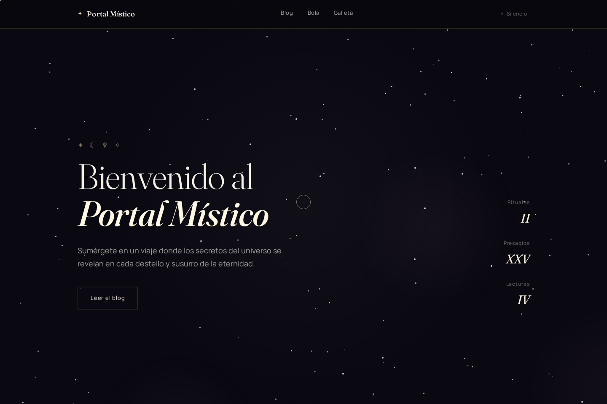
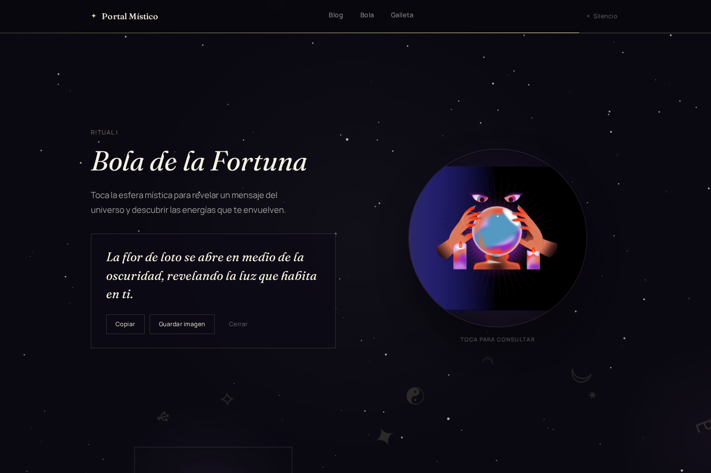
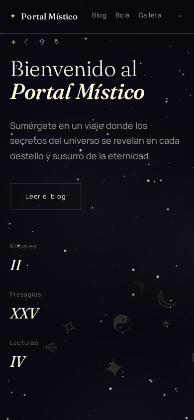

# Portal Místico

**Portal Místico** es un portafolio esotérico de una sola página: un blog místico, una bola de la fortuna animada y una galleta de la fortuna, cada una con mensajes aleatorios del universo — incluyendo presagios "legendarios" que aparecen con muy poca probabilidad.

**🔮 [Ver el sitio en vivo](https://galleta-fortuna-rq4a.vercel.app/)**



## Demo visual

| Bola de la fortuna | Vista móvil |
|---|---|
|  |  |

## Características

- **Blog Esotérico** — cuatro artículos con lectura expandible sobre sincronicidad, astrología y sabiduría ancestral.
- **Bola de la Fortuna** — animación interactiva hecha en [Rive](https://rive.app/), cargada de forma diferida (solo se descarga cuando el usuario se acerca a esa sección).
- **Galleta de la Fortuna** — mensajes aleatorios que nunca se repiten dos veces seguidas.
- **Presagios legendarios** — ~2% de probabilidad de un mensaje especial con su propio efecto visual.
- **Guardar como imagen** — genera y descarga (o comparte, si el navegador lo soporta) una tarjeta con el mensaje revelado, dibujada en `<canvas>`.
- **Audio ambiental** con un chime sutil (sintetizado con Web Audio API, sin archivos de audio extra) al revelar cada mensaje.
- **Fondo cósmico animado**: esferas, un campo de más de 100 estrellas y símbolos de tarot a la deriva.
- **Cursor personalizado**, microinteracciones magnéticas y revelados orgánicos al hacer scroll con [Framer Motion](https://www.framer.com/motion/).
- **Accesible**: HTML semántico, `aria-*` en controles interactivos, skip-link, respeta `prefers-reduced-motion`.
- **Responsive**, de escritorio a móvil.

## Stack

- **[React 19](https://react.dev/)** + **[Vite](https://vitejs.dev/)**
- **[Framer Motion](https://www.framer.com/motion/)** — animaciones y revelados
- **[@rive-app/react-canvas](https://rive.app/)** — animación interactiva de la bola de la fortuna
- **CSS Modules** — estilos encapsulados por componente, sin librerías de UI

## Arquitectura

```
src/
├── components/       # un componente por carpeta, con su CSS Module
│   ├── Atmosphere/    # fondo cósmico (esferas, estrellas, tarot)
│   ├── BlogSection/
│   ├── Cursor/
│   ├── FortuneRitual/ # bola (Rive) y galleta de la fortuna
│   ├── Hero/
│   ├── Reveal/        # wrapper reutilizable de scroll-reveal
│   ├── SiteFooter/
│   └── SiteHeader/
├── data/              # contenido (mensajes, artículos)
├── hooks/             # useMagnetic, useInView, usePrefersReducedMotion
├── lib/               # lógica desacoplada: sorteo de mensajes, tarjeta
│                      # compartible (canvas), sonido
└── styles/            # tokens de diseño (color, tipografía, espaciado)
```

## Instalación

```bash
git clone https://github.com/YuthramysI/Galleta-fortuna.git
cd Galleta-fortuna
npm install
```

## Uso

```bash
npm run dev       # servidor de desarrollo
npm run build     # build de producción (carpeta dist/)
npm run preview   # sirve el build de producción localmente
npm run lint      # ESLint
```

## Autoría

Diseñado y desarrollado por **Yuthramys** como proyecto de portafolio.
